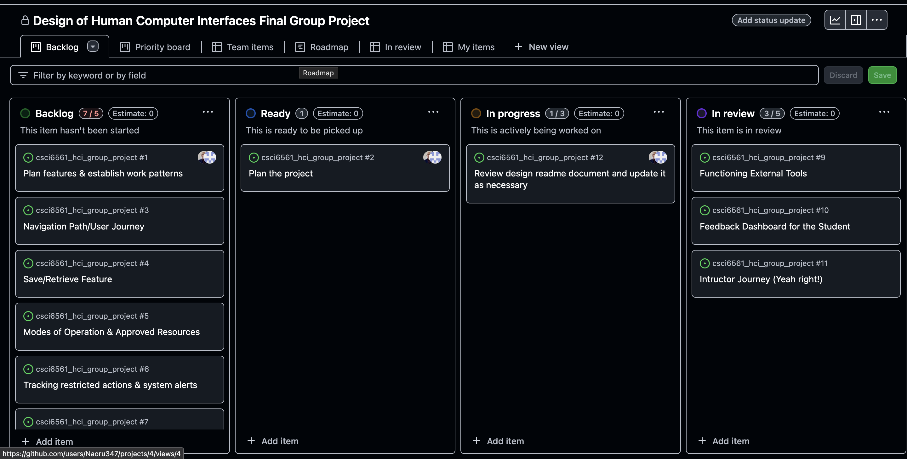
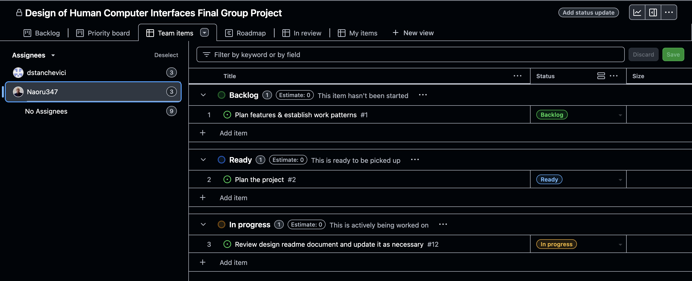

# Design Read-me & Documentation Notes

## Outline of What Users (Students) Can Do

Our app [NAME OF APP] is a browser-based app that allows students to complete writing assignments with no or limited access to the Internet, local networks, or device-based resources. Teachers can use this app to assess students’ ability to write independently of generative AI tools. This app serves two groups of users, teachers and students. Our project focuses on only the students’ experience and interfaces.

This app allows students to complete the following tasks:
- view a list of assignments to be completed and their deadlines
- select an assignment and read its description
- compose a response to the assignment in one the following two modes specified for this assignment by the teacher
      - **Undistracted Writing** allows no acccess to resources outside the app. The copy/paste functionality is disabled.
      - **Writing With Resources** allows access to such teacher-approved resources as the student’s past assignments with the feedback from the teacher, files uploaded by the student or the teacher, and some websites. Copying from the allowed resources and pasting into the current work is enabled.
- submit the written assignment
- view and add comments to a report that is submitted with the assignment and that details system failures that occurred during the completion of the assignment and the student’s attempts to performed restricted actions during the completion of the assignment
- upload files that, after the teacher’s approval, can be accessed in the Limited Access mode

### Section Ownership
- Primary Owner: Dmitri Stanchevici
- Contributor: J. M. Paiz

## Concepts Needed to How to Interact
- **Protected Composition Space**: A protected composition space refers to a workspace for students to engage in the act of composing--the intentional arrangement of knowledge in written form for a critical dialogue (e.g., Copenhagen Business School, 2022)--in a sheltered, distraction-free environment. Specifically, it is one that encourages undistracted writing and focusing solely on the student-writer deploying those resources and knowledge-bases overwhich they have the most immedidate/direct control with the goal of encouraging them to grow these skills through targeted practice and application activities (Gessell, 2021). We can see this as operating in a customizable set of modes from most- to least-protectred, based on the needs of the assignment/stage of writing. 
- **Undistracted Writing**: Undistracted writing here refers to the purest mode of composition, one in which the student-writer only has access to their immediate knowledgebases, linguistic toolkits, and rhetorical repetiors. In undistracted writing, it is just the student, the WYSIWYG editor, and their embodied cognitive affordances. 
- **Supported Writing**: Supported writing here refers to the act of composing with some form(s) of external cognitive/linguistic affordance(s), such as a source article on a topic, an academic word list, an AI-powered grammar checker (which is all of them post-2013 (Park, 2019)). 
   - **Writing with Resources**: A related sub-concept. Writing with resources serves as a synonym for supported writing and will be used in in-app feedback to the user to signal when they will be able to make selective and limited use of external resources to aid them in their compositional processes. This mode of writing most closely mirrors what professional, technical, and academic writers do in their daily practice. 
- **Overarching Metaphor - The Stoplight**: Users will need to be aware of the overarching metaphor that governs the visual feedback of this application, viz. the stoplight. Composition spaces will be color-coded to provide immediate visual feedback to the user as to whether they're working in "Undistracted" (red light), "Writing with Resources" (yellow light), or "Unrestricted" (green light) modes, akin to the stoplight which signals restricted movement (red light), limited movement (yellow light), and free movement (green light).
- **Professor/Student Selected Resources**: Users will also need to understand what professor and student selected resources are and their role in the composition space/process. Here, their shared property is that they are pre-selected and pre-vetted resources that can be used by a student-writer when an assignment is working in the Writing with Resources mode. The key difference is the source of either being student curated and instructor curated. 
- **Submission Reports**: Users will be need to be aware of the submission reports and how these reports outline any restricted actions that the user attempted to take while making use of the application. 

### Section Ownership
- Primary Owner: J. M. Paiz
- Contributor: Dmitri Stanchevici

## Description of Intended User Experience 

We strive to make our app usable for students. It is effective because students can use it to demonstrate their ability to compose and submit written assignments with no or limited access to external or device-based resources. It also is efficient because it enables students to get down to the composing and the submitting with the minimum necessary clicks. A simple and logical sequence of steps toward composing, consulting allowed resources, and submitting assignments together with an accompanying report should ensure learnability and memorability. Finally, and very importantly, we strive for safety. While the app is unlikely to cause any direct physical harm, it serves as a medium for a high-stakes activity--graded assignments. In case of a system failure, the app assures the student that their composition has been saved and that the student can retrieve it and continue working. If the student clicks submit, the app assures them that the composition has indeed been submitted. Finally, if the student performs a disallowed activity, alerts tell the student about an error and provide ways to rectify it.

We want students to feel that our app is a timely and competent response to the problem of limited opportunity to develop and demonstrate one’s ability to write without generative AI. The function of our app--to restrict access to advanced tools--may evoke in students a feeling that they are dealing with something oppressive and outdated. To counteract this emotional response, we use a visual design that creates a modern look that may appeal to a younger user (we assume that most students using our app will be young). We also avoid words with a negative connotation in the interface, such as “lockdown.” Instead, we use such words as “independent writing” or “undistracted writing” to create for the student a sense of opportunity and achievement. 

### Section Ownership
- Primary Ownder: Dmitri Stanchevici
- Contributor: J. M. Paiz

## Project Management
For project management, we utilized a highly collaborative team approach with members sharing roughly equally in the majority of tasks through a primary owner/contributor model. In this model, the primary owner would be responsible for between 51-75% of a given sub-task and contributors expected to contribute the remaining 25-49% of effort. The goal being that, on average, each group member contributed equally to project labor. 

To aid in this, we made regular use of GitHub projects to assign tasks, manage project deliverables, and maintain open, clear communication (see Figures, below, for an early example)

### GitHub Project Dashboard Sample

### GitHub Project Assignee Dashboard Sample

### Project Management Ownership
- Primary Owner: J. M. Paiz
- Contributor: D. Stanchevici

## Documentation Notes
This section outlines early thoughts on what to include in final documentation to be submitted upon project submission.
### Documentation Reqs per Assignment Prompt
- File Name: conceptual_model.pdf
- Front matter: Each group members name on top of page (ABC, Ascending)
- Outline of what users can do - 20%
   - Assigned
- Concepts needed to understand how to interact - 20%
      - Assigned
- Functionality - 20%
- Description of intended user experience - 20%
      - Assigned
- Metaphor and interaction types - 20%

Note for each section be prepared to:
- Justify design decisions
- Discuss possible issues related to course terms (see note below for an example)
- Discuss group members roles/ownership

### Notes
- Discuss the choice of the stop light as metaphor
   - What *inclusivity* issues might exist?
   - What *accessibility issues might exist?
      - What compensating controls have you implemented to attempt to overcome/mitigate these issues (e.g., using web-safe colors).

### Documentation Ownership
- Primary Owner: J. M. Paiz
- Contributor: D. Stanchevici

## References
- Copenhagen Business School (2022). Scholarly composition. *Library of the Copenhagen Business School*. https://inframethodology.cbs.dk/?p=5065
- Gessell, B. (2021).  Deliberate practice for academic writers: A three-step process to improve academic writing. *Writing is Thinking* https://writingisthinking.com/wp-content/uploads/2021/05/Deliberate-Practice-Part-3-Bryce-Gessell.pdf