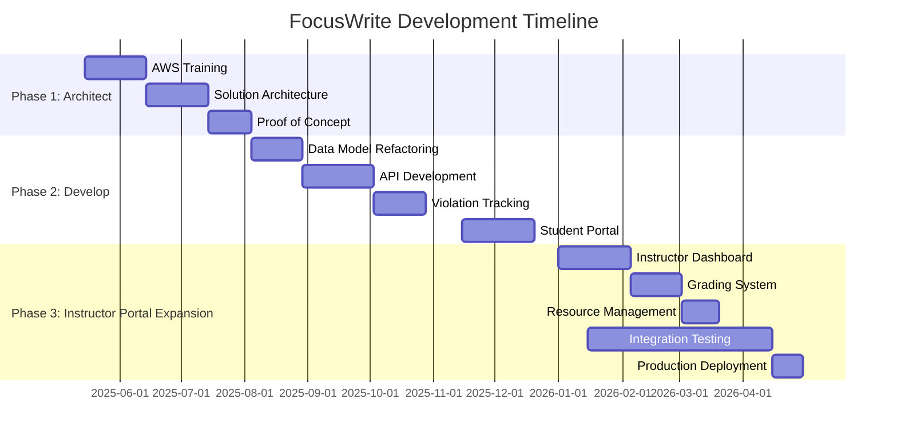

# FocusWrite: Secure Lockdown Browser for Academic Writing
## Executive Summary for Program Leadership

### Overview
FocusWrite is a web-based lockdown browser environment designed specifically for academic writing assignments. It provides a secure testing environment that prevents students from accessing unauthorized resources during in-class writing assignments while supporting legitimate reference materials provided by instructors.

### AWS Implementation Architecture
We've designed a cost-efficient AWS cloud solution that will support 200-300 students annually, with peak usage during the Fall semester (August-December):

**Key Components:**
- **Student Portal**: Secure web interface for completing assignments
- **Instructor Portal**: Dashboard for creating/managing assignments and grading
- **Assignment Resources Storage**: Secure storage for instructor-provided PDFs (25-150MB each)
- **Security Features**: Authentication, violation tracking, and access controls

### Cost Projection

#### Infrastructure Costs (Annual)

| AWS Component | Details | Academic Year Pattern | Annual Cost Estimate |
|---------------|---------|------------------------|----------------------|
| **S3 Storage** | 1.25-33.75GB PDF resources 0.5-22.5GB student submissions | Peak: Aug-Dec Low: Jan-Jul | $7-15/year |
| **DynamoDB** | On-demand capacity for tables | Peak: 25,000-50,000 ops/month Low: 5,000-10,000 ops/month | $0-5/year (free tier) |
| **Lambda** | Serverless function execution | Peak: 20,000-30,000 invocations/month Low: 5,000-10,000 invocations/month | $0/year (free tier) |
| **Cognito** | User authentication | 200-300 users annually | $0/year (free tier) |
| **API Gateway** | API request handling | Peak: 15,000-25,000 requests/month Low: 5,000-10,000 requests/month | $0/year (free tier) |
| **CloudWatch** | Basic monitoring | Minimal metrics and alarms | $0-5/year |
| **Data Transfer** | Inbound/outbound traffic | Estimated 50GB annually | $0-5/year |

#### Software Costs (Annual)

| Component | Options | Annual Cost Estimate |
|-----------|---------|----------------------|
| **TinyMCE Editor** | Option A: Self-hosted (GPL license) | $0 |
| | Option B: Cloud Basic (1,000 editor loads/month) | $0 (free tier) |
| | Option C: Cloud Professional (if exceeding free tier) | $399-480/year |

#### Total Cost of Ownership

| Timeframe | Minimum Estimate | Maximum Estimate | Notes |
|-----------|------------------|-----------------|-------|
| **Year 1 (with AWS free tier)** | $7/year | $510/year | Assumes self-hosting TinyMCE |
| **Ongoing Annual (post free tier)** | $12/year | $510/year | Infrastructure + software only |

*Notes:*
1. AWS free tier benefits apply for the first 12 months of a new AWS account
2. Storage costs represent the largest recurring expense
3. Faculty development costs are excluded as this will be done as professional service
4. TinyMCE self-hosted option is recommended to eliminate recurring software costs

### Implementation Timeline

Given the project complexity and resource constraints (two part-time faculty developers with limited AWS experience), we recommend the following phased approach over a 9-month development cycle:

#### Development Timeline (9 Months)

#### Phase 1: Learning & Architecture (2-3 months)
1. **AWS Training** (3-4 weeks): Focused learning on AWS services and serverless architecture
2. **Solution Architecture** (3-4 weeks): Detailed design of AWS components and data flows
3. **Proof of Concept** (2-3 weeks): Simple prototype to validate key technical approaches

#### Phase 2: Core Development (3-4 months)
1. **Data Model Refactoring** (3-4 weeks): Update schemas for serverless implementation
2. **API Development** (4-5 weeks): Implement Lambda functions for core functionality
3. **Enhanced Violation Tracking** (3-4 weeks): Expanded monitoring and reporting features
4. **Student Portal Migration** (4-5 weeks): Refactor existing frontend for AWS integration

#### Phase 3: Instructor Portal & Refinement (2-3 months)
1. **Instructor Dashboard** (4-5 weeks): Assignment management interface
2. **Grading System** (3-4 weeks): Review and feedback functionality
3. **Resource Management** (2-3 weeks): PDF upload and organization features
4. **Integration Testing** (3-4 weeks): Comprehensive system testing
5. **Production Deployment** (2-3 weeks): Staged rollout with monitoring

#### Key Milestones
- **Month 3**: Complete architecture design and validation
- **Month 6**: Working proof of concept with basic functionality
- **Month 8**: Student portal fully functional in AWS environment
- **Month 9**: Instructor portal and full system integration

### Benefits
- **Academic Integrity**: Prevents unauthorized resource access
- **Flexibility**: Supports instructor-defined resources and reference materials
- **Cost Efficiency**: Minimal AWS costs due to seasonal usage patterns
- **Scalability**: Easily accommodates growth in student numbers or classes
- **Security**: Real-time monitoring and violation reporting

### Recommendations
1. **Self-host TinyMCE**: Use the GPL-licensed version to eliminate recurring costs
2. **Implement lifecycle policies**: Automatically move older data to low-cost storage
3. **Schedule resources**: Scale up during peak periods, scale down during off-peak
4. **Batch operations**: Optimize database operations to minimize costs

### Development Considerations & Challenges

**Resource Constraints:**
- Two faculty developers working part-time with limited AWS experience
- Need for significant learning curve with serverless architecture
- Complex refactoring of existing application for cloud deployment

**Technical Challenges:**
- Data model redesign for DynamoDB's NoSQL structure
- Serverless function implementation for all application logic
- Enhanced monitoring for expanded violation types
- Complex instructor portal with PDF resource management
- Cross-browser compatibility for lockdown features

**Risk Mitigation Strategies:**
1. **AWS Training Investment**: Allocate dedicated time for AWS certification or focused learning
    - In progress: Joshua will sit for the AWS Certified Solutions Architect Exam on 17 May 2025.
2. **Simplified MVP Approach**: Identify core features for initial release vs. future enhancements
3. **Development Scaffolding**: Utilize AWS Amplify or similar tools to accelerate serverless development
4. **Regular Architecture Reviews**: Schedule bi-weekly check-ins to prevent technical debt

### Next Steps
1. **Secure AWS Account & Budget**: Establish educational account with spending alerts
2. **Schedule AWS Training**: Enroll developers in AWS training focusing on serverless architecture
3. **Develop Technical Specification**: Create detailed architectural and functional specifications
4. **Create Phased Roadmap**: Break development into achievable milestones with clear deliverables
5. **Establish Testing Plan**: Define validation strategies for academic security requirements
---
Prepared by: Joshua M. Paiz | Dated: May 5, 2025